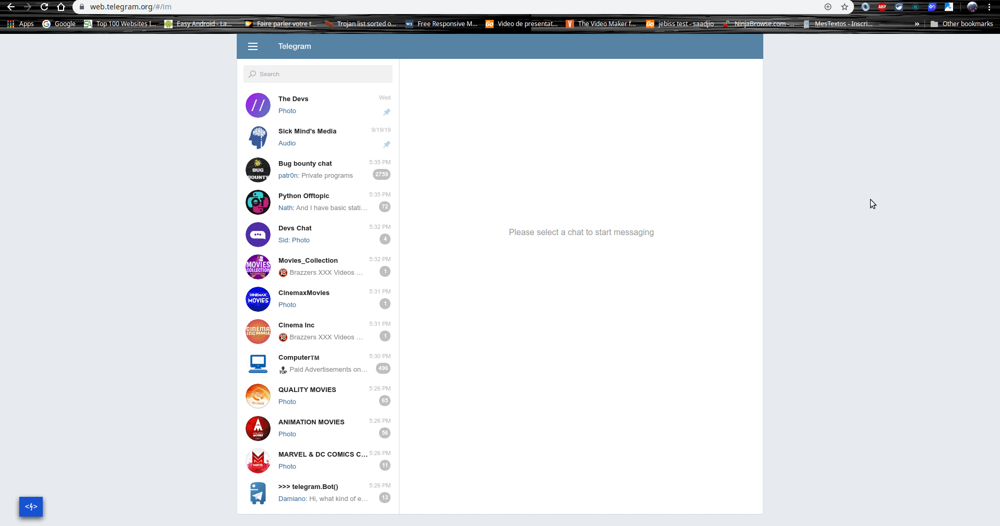

# Cezam

***"Hacker" is not synonymous with criminal. A hacker is someone who finds a new and different way to do something. #Breakthrough***

### Introduction

This project began as a night project and finaly am getting more interested on finish it.

Telegram is the one of the biggest chat platform i know right now and i mostly use it because of it's channels; there are tones and tones of channels of movies, animes, pictures, available for free there.
The idea behind Cezam was build an alternative UI of telegram as a Gallery for movies/series/pictures.

STATUS : ON GOING...

## Requirements

- Chrome browser (Any version supporting the extensions Feature).
- Cezam was coded from scratch, any lib used.

### How it's works

Cezam just inject in the DOM some JS to create it's own UI based on telegramWEB real datas.
A more Readme/Documentation will be provide after the project will be too advanced.

### How to use it

- Menu > More Tools > Extensions
- Just import the `./cezam` directory by clicking on `load unpacked` Extension.

### Rendering

### Author

- [Sanix darker](https://github.com/Sanix-Darker)

### LICENSE:

[MIT License](https://github.com/Sanix-Darker/embed/blob/master/LICENSE)